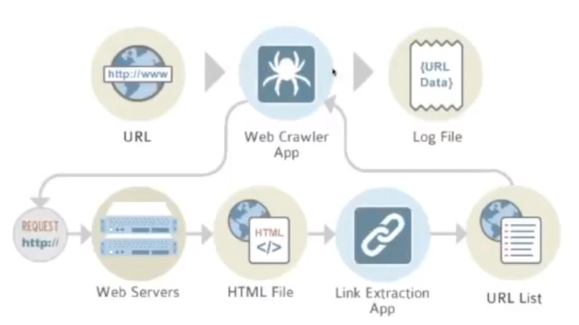

# CrawlingWeb-KeepCoding
Taller de Crawling Web en la plataforma KeepCoding

- [CrawlingWeb-KeepCoding](#crawlingweb-keepcoding)
- [1. Introducción](#1-introducci%c3%b3n)
- [2. Crawler](#2-crawler)
  - [2.1 ¿Qué es un web crawler?](#21-%c2%bfqu%c3%a9-es-un-web-crawler)
  - [2.2 ¿Qué no es un crawler?](#22-%c2%bfqu%c3%a9-no-es-un-crawler)
  - [2.3 ¿Para qué puede servir?](#23-%c2%bfpara-qu%c3%a9-puede-servir)
  - [2.4 Casos de éxito](#24-casos-de-%c3%a9xito)
- [3. Scrapy](#3-scrapy)
  - [3.1 Ejemplo de spider](#31-ejemplo-de-spider)

# 1. Introducción

- Para más info visitar [este enlace](https://github.com/rvegas/webcrawling)
- [Google Colaboratory](https://colab.research.google.com/notebooks/intro.ipynb#recent=true)
- [Scrapy](https://scrapy.org)

# 2. Crawler

## 2.1 ¿Qué es un web crawler?



Un rastreador web, indexador web, indizador web o araña web es un programa informático que inspecciona las páginas del World Wide Web de forma metódica y automatizada.
Uno de los usos más frecuentes que se les da consiste en crear una copia de todas las páginas web visitadas para su procesado posterior por un motor de búsqueda que indexa las páginas proporcionando un sistema de búsquedas rápido. Las arañas web suelen ser bots.

## 2.2 ¿Qué no es un crawler?

- No es hackear.
- No se puede llegar a todas las páginas webs/países. 
- No es un proceso complejo. Se suelen romper/morir mucho debido al constante cambio de las webs.
- No suele ser el objetivo generar dinero.

## 2.3 ¿Para qué puede servir?

- BigData
- Inteligencia artificial
- Índice de costes de productos
- Suele simular/causar ataques DoS
- Post-procesamiento, motores de recomendación
- Importante para temas SEO

## 2.4 Casos de éxito

- PublicRecordsNOW
- Baratukin
- Google

# 3. Scrapy

## 3.1 Ejemplo de spider
```python
import scrapy
import json

class BlogSpider(scrapy.Spider):
    name = 'blogspider'
    # Podeis cambiar la url inicial por otra u otras paginas
    start_urls = ['https://blog.scrapinghub.com']
    
    # con esto limito no hacer mas de 10 ejecuciones 
    COUNT_MAX = 10
    count = 0

    def parse(self, response):
        # Aqui scrapeamos los datos y los imprimimos a un fichero
        for article in response.css('div.post-item'):
            title_text = article.css('div.post-header h2 a ::text').extract_first().strip().replace(',', '').replace('.', '')
            extract_text = article.css('div.post-content p ::text').extract_first()
            if extract_text is not None:
              extract_text = extract_text.strip().replace(',', '').replace('.', '')
              
            # Print a un fichero
            print(f"{title_text}, {extract_text}\n", file=filep)

        # Aqui hacemos crawling (con el follow)
        for next_page in response.css('a.next-posts-link'):
            self.count = self.count + 1
            if (self.count < self.COUNT_MAX):
                yield response.follow(next_page, self.parse)
```